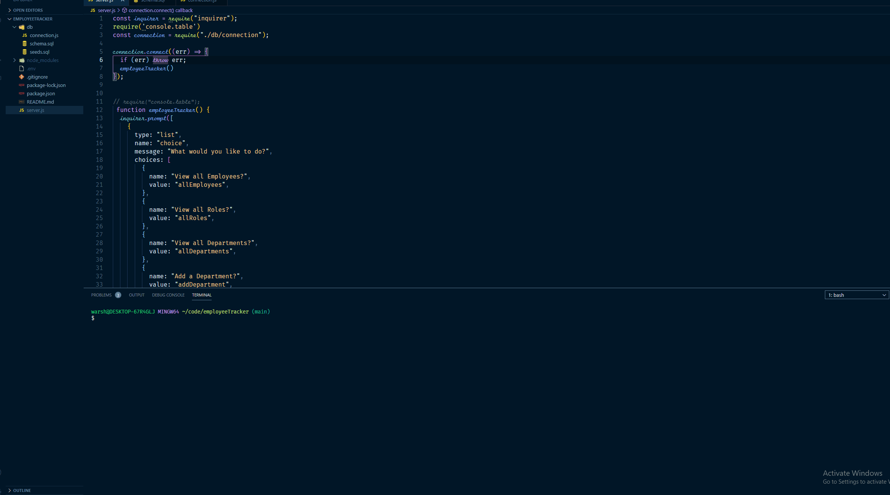

# Employee Tracker
 

 
### Table of Contents:
* [User Story](##-User-Story)
* [Description](##-Description)
* [Installation](##-Installation)
* [Credits](##-Credits)
* [Contributors](##-Contributors)
* [License](##-License)
 
## Deployed site
<!-- [Title of Site](Site-Link) -->

 
## User Story
As a business owner
I want to be able to view and manage the departments, roles, and employees in my company
So that I can organize and plan my business
 
## Description
Description of Website and what technologies were used
 
## Installation
How to install and run app/website
 
## Contributors
Efrain Nevarez
 
## Credits
Credits for anything used to build site
 
## License
This project is licensed by MIT